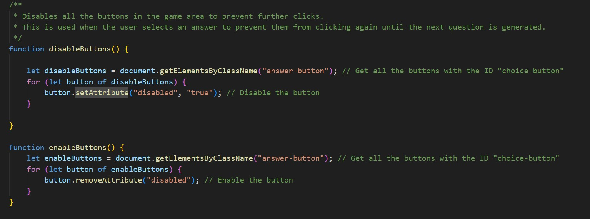
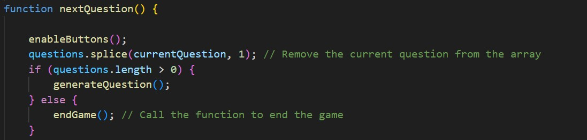
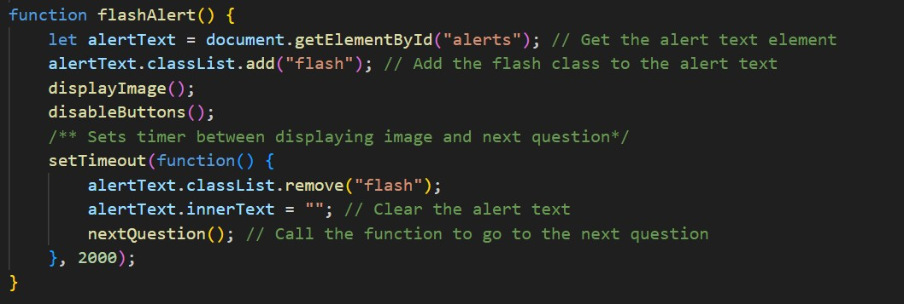
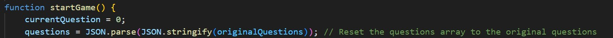

## Testing

### Functionality Testing

| Test | Description | Expected Outcome | Result |
|------|-------------|-----------------|--------|
| Start Game | Click the "Start Game" button to begin | Game area should display a quote and answer options | PASS |
| Answer Selection | Click on an answer option | System should check if the answer is correct and provide feedback | PASS |
| Score Tracking | Answer questions correctly and incorrectly | Scores should update accordingly | PASS |
| Image Reveal | Select an answer | Blurred image should clear to reveal the author | PASS |
| Next Question | After answering a question, wait for the next one | New question should appear after 2 seconds | PASS |
| Game Completion | Answer all 15 questions | Game should display a summary with total score | PASS |
| Restart Game | Click "Restart" during a game | Game should reset with new questions and scores back to zero | PASS |

### Browser Compatibility

| Browser | Version | Compatibility | Notes |
|---------|---------|---------------|-------|
| Chrome  | Latest  | Full          | All features work as expected |
| Firefox | Latest  | Full          | All features work as expected |
| Safari  | Latest  | Full          | All features work as expected |
| Edge    | Latest  | Full          | All features work as expected |

### Responsiveness Testing

| Device/Screen Size | Compatibility | Notes |
|-------------------|---------------|-------|
| Desktop (1920px)  | Full          | All elements display correctly |
| Laptop (1366px)   | Full          | All elements display correctly |
| Tablet (768px)    | Full          | Elements resize appropriately |
| Mobile (480px)    | Full          | Elements stack vertically as designed |

### Validator Testing

- HTML
  - No errors were returned when passing through the official [W3C validator](https://validator.w3.org/)
- CSS
  - No errors were found when passing through the official [(Jigsaw) validator](https://jigsaw.w3.org/css-validator/)

### Manual Buttons Testing

1. Button Hover Effects
 - Expected behavior: All buttons should change color when hovered over
 - Test method: Move cursor over each button (Start/Restart button and all answer option buttons)
 - Success criteria:
    * Button background smoothly transitions to the hover state color
    * Transition animation takes approximately 0.3 seconds as specified in CSS
    * Cursor changes to pointer style
2. Button Functionality
 - Expected behavior: All buttons trigger appropriate actions when clicked
 - Test method:
    * Click Start button to begin game
    * Click each answer option during gameplay
 - Success criteria:
    * Start button initiates game with first question displayed
    * Answer buttons correctly register user selection
    * Each button click produces exactly one response (no double-triggering)
3. Dynamic Button Text
 - Expected behavior: Start button text updates based on game state
 - Test method:
    * Note initial button text ("Start Game")
    * Click button to start game
    * Complete game and check text again
 - Success criteria:
    * Text changes to "Restart" when game is in progress
    * Text reverts to "Start Game" after game completion
4. Button State Management
 - Expected behavior: Buttons are disabled/enabled at appropriate times
 - Test method:
    * Start game and select an answer
    * Attempt to click other answers during the 2-second feedback period
    * Observe behavior when next question appears
 - Success criteria:
    * All answer buttons are disabled immediately after selection
    * Clicking disabled buttons produces no effect
    * All buttons are re-enabled when next question is displayed
    * If all questions are answered, Start/Restart button remains active

### Known Bugs and Fixes

#### Fixed Bugs
- **Issue**: When clicking answer buttons rapidly, multiple scores could be recorded.
  - **Fix**: Disabled buttons after selection to prevent multiple clicks.
    

- **Issue**: Image aspect ratio distortion on smaller screens.
  - **Fix**: Added CSS media queries to adjust image size appropriately.

- **Issue**: Questions needed to appear in random order.
  - **Fix**: Implemented a randomization algorithm using Math.random().

- **Issue**: The same question appears multiple times in each round.
  - **Fix**: Used array splice() method to remove used questions.
    

- **Issue**: Multiple functions needed proper sequencing.
  - **Fix**: Added a 2-second delay between answer selection and next question.
    

- **Issue**: Questions array is emptied when the game is over forcer the user to referesh the page before starting gain.
  - **Fix**: Creates a separate constant originalQuestions to store all the questions and hard reset the array. 
    

#### Remaining Issues
- None currently identified. All known issues have been resolved.

# User Stories Implementation

## User Story 1: Game Questions

> **As a player I want to answer the questions in the game**

### Implementation:

1. **Random Question Generation**:
   - A JavaScript function selects questions randomly from the questions array
   - Each used question is removed from the array to prevent repetition
   - This ensures a unique experience each time the game is played

2. **Multiple Choice Format**:
   - Each quote is presented with four possible authors to choose from
   - Options are dynamically generated as clickable buttons
   - The correct answer is stored in the question object for verification

3. **Responsive Design**:
   - Media queries ensure the game interface adapts to different screen sizes
   - Question text and buttons resize appropriately on mobile devices
   - The layout adjusts from a grid to a vertical stack on smaller screens

## User Story 2: Game Rules

> **As a player I want to see the rules for the trivia game**

### Implementation:

1. **Dedicated Rules Section**:
   - A prominently placed section at the top of the page contains all game instructions
   - Clear headings and structured content make the rules easy to scan

2. **Comprehensive Instructions**:
   - The rules explicitly state that there are 15 questions in total
   - Instructions explain how to interact with the game (clicking options)
   - The scoring system is clearly explained (1 point per correct answer)
   - The game progression and ending conditions are described

3. **User-Friendly Presentation**:
   - Rules are visible before starting the game
   - Typography ensures readability with appropriate font sizes and contrast
   - Instructions are concise and written in simple, straightforward language

## User Story 3: Answer Feedback

> **As a player I want to know If I've chosen the correct answer**

### Implementation:

1. **Answer Verification**:
   - The game checks the selected answer against the stored correct answer
   - A verification function runs immediately when an option is clicked

2. **Clear Feedback**:
   - Correct answers display "Correct!" in green text
   - Incorrect answers show "Wrong! The correct answer is: [correct answer]" in red text
   - This feedback appears prominently in the scoreboard area

3. **Image Reveal**:
   - Each question includes a blurred image of the quote's author
   - After answering, the blur effect is removed to reveal the image
   - This visual confirmation adds context and reinforces learning

4. **Timed Progression**:
   - Feedback remains visible for 2 seconds before moving to the next question
   - This gives players time to process the information
   - Buttons are temporarily disabled to prevent multiple selections

## User Story 4: Score Tracking

> **As a player I want to see my score at the end of the game**

### Implementation:

1. **Real-time Score Display**:
   - A dedicated scoreboard section shows both correct and incorrect counts
   - Scores update immediately after each question is answered
   - The display is positioned prominently for easy reference

2. **Score Calculation**:
   - Incrementation functions track correct and incorrect answers
   - Running totals are maintained throughout the game
   - No complex calculation is needed as scores accumulate in real-time

3. **Game Completion Summary**:
   - When all questions are answered, a modal dialog shows the final score
   - The summary clearly displays both correct and incorrect tallies
   - The SweetAlert2 library creates a visually appealing popup that works on all devices

4. **Responsive Score Display**:
   - The scoreboard is styled to be readable on all screen sizes
   - Font sizes and spacing adjust on smaller screens
   - High-contrast colors ensure visibility

